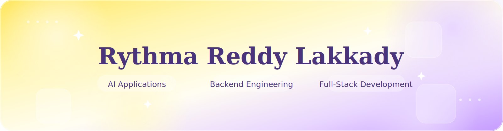

<!-- ========================================================= -->
<!--                    RYTHMA REDDY LAKKADY                    -->
<!--                      GitHub Profile README                 -->
<!--                         PART 1 OF 4                        -->
<!-- ========================================================= -->

<p align="center">
  
</p>

<p align="center">


</p>

<p align="center">

<a href="https://github.com/RythmaLakkady">

</a>

<a href="https://www.linkedin.com/in/rythma-lakkady-1725852a2/">

</a>

<a href="mailto:rythmalakkady@gmail.com">

</a>

<a href="https://github.com/RythmaLakkady">

</a>

</p>

<p align="center">


</p>

---

# Hi, I'm Rythma 👋

I'm a Computer Science undergraduate who enjoys building software that solves practical problems.

My interests currently revolve around **AI-powered applications**, **backend engineering**, **full-stack development**, and creating products that people can actually use.

I enjoy turning ideas into deployable software while continuously improving my engineering skills through hands-on projects and open-source technologies.

---

<h1 align="center">Tech Stack</h1>

<table align="center">

<tr>

<td valign="top" width="25%">

### Languages

<p align="center">

</p>

</td>

<td valign="top" width="25%">

### Frameworks

<p align="center">

</p>

</td>

</tr>

<tr>

<td valign="top">

### Databases & Cloud

<p align="center">

</p>

</td>

<td valign="top">

### Tools

<p align="center">

</p>

</td>

</tr>

</table>

---

### AI & Machine Learning

```text
LangChain • ChromaDB • Hugging Face Transformers • CLIP • Vision Transformers • YOLO • XGBoost • Gemini API • OpenCV
```

<!-- ================= END OF PART 1 ================= -->


<!-- ========================================================= -->
<!--                    Featured Projects                          -->
<!--                      PART 2 OF 4                          -->
<!-- ========================================================= -->

---

<h1 align="center">Featured Projects</h1>

<p align="center">
Projects that reflect my interest in building practical software solutions using AI, backend engineering, and modern web technologies.
</p>

---
# Featured Projects

<p align="center">
A selection of projects showcasing my interest in AI-powered applications, backend engineering, machine learning, and full-stack development.
</p>

---

<details open>

<summary>

## 🛡️ ShadowQA
**AI-Powered API Testing & Debugging Framework**

</summary>

### Overview

ShadowQA is an AI-powered framework that automates REST API testing from OpenAPI specifications. It leverages Retrieval-Augmented Generation (RAG) to generate comprehensive test suites, identify edge cases, and provide contextual debugging assistance.

### Tech Stack

| Category | Technologies |
|-----------|--------------|
| **Language** | Python |
| **Frameworks** | Streamlit, LangChain |
| **Database** | SQLite, ChromaDB |
| **AI** | Llama 3.3 |
| **Concepts** | RAG, Asynchronous Processing |

### Highlights

- Automated API test generation from OpenAPI specifications
- Concurrent evaluation pipeline for REST endpoints
- Context-aware debugging using LangChain and ChromaDB
- Structured JSON coverage reports
- Reduced manual testing effort through automation

<p align="center">

<a href="https://github.com/RythmaLakkady/ShadowQA">

</a>

<a href="https://shadowapp.streamlit.app/">

</a>

</p>

</details>

---

<details>

<summary>

## 🌍 WanderGen
**AI-Powered Travel Planning Platform**

</summary>

### Overview

WanderGen is a full-stack travel planning platform that generates personalized itineraries using user preferences such as destination, budget, interests, and trip duration, combining AI recommendations with an intuitive React interface.

### Tech Stack

| Category | Technologies |
|-----------|--------------|
| **Frontend** | React.js |
| **Authentication** | Firebase |
| **AI** | Gemini API |
| **Concepts** | REST APIs, Component-Based Architecture |

### Highlights

- Personalized AI-generated travel itineraries
- Responsive React interface
- Firebase Authentication
- Modular and reusable components
- AI-assisted recommendation workflow

<p align="center">

<a href="https://github.com/RythmaLakkady/wandergen">

</a>

</p>

</details>

---

<details>

<summary>

## 🔍 SceneSolver
**Multimodal Crime Scene Analysis Tool**

</summary>

### Overview

SceneSolver explores multimodal AI for forensic evidence analysis by combining computer vision techniques with structured metadata generation. I contributed to building and integrating components of the computer vision pipeline.

### Tech Stack

| Category | Technologies |
|-----------|--------------|
| **Language** | Python |
| **Libraries** | TensorFlow, OpenCV |
| **Models** | CLIP, Vision Transformers |

### Highlights

- Image classification pipeline
- Structured JSON and CSV outputs
- Modular preprocessing workflow
- Multimodal inference pipeline

<p align="center">

<a href="https://github.com/adityapanyala/SceneSolver">

</a>

</p>

</details>

---

<details>

<summary>

## 🚦 Traffic Demand Prediction System
**Machine Learning for Urban Traffic Forecasting**

</summary>

### Overview

A machine learning pipeline that predicts urban traffic demand using XGBoost. The project focuses on scalable preprocessing, feature engineering, and high-accuracy traffic forecasting on large datasets.

### Tech Stack

| Category | Technologies |
|-----------|--------------|
| **Language** | Python |
| **Libraries** | Pandas, NumPy |
| **Model** | XGBoost |

### Highlights

- R² Score of **0.96**
- Evaluated on **41,700+ samples**
- Scalable preprocessing pipeline
- Feature engineering workflow
- Sub-second inference

<p align="center">

<a href="https://github.com/RythmaLakkady/flipkart-gridlock-traffic-prediction">

</a>

</p>

</details>

---

# Currently Building

Although these aren't complete projects yet, they're areas I'm actively working on and excited to expand.

- 🌐 Personal Portfolio Website
- ⚙️ Backend-focused Projects
- 🤖 Deployable AI Applications
- 🔄 Automation Workflows with n8n
- 🌱 Open Source Contributions

<!-- ================= END OF PART 2 ================= -->

<!-- ========================================================= -->
<!--              EXPERIENCE • LEADERSHIP • ACHIEVEMENTS        -->
<!--                      PART 3 OF 4                          -->
<!-- ========================================================= -->


# Certifications

<p align="left">

<a href="https://www.hackerrank.com/certificates">


</a>


</p>

---

<h2 align="center">Coding Profiles</h2>

<p align="center">
  <a href="https://leetcode.com/u/RythmaLakkady/">
    
  </a>

  <a href="https://github.com/RythmaLakkady">
    
  </a>

  <a href="https://www.linkedin.com/in/rythma-lakkady-1725852a2/">
    
  </a>
</p>

<!-- ================= END OF PART 3 ================= -->

<!-- ========================================================= -->
<!--                 GITHUB ACTIVITY & CONNECT                 -->
<!--                      PART 4 OF 4                          -->
<!-- ========================================================= -->

---

# Development Activity

<p align="center">
  

  
</p>

<p align="center">
  
</p>

<p align="center">  </p>

<p align="center">
  
</p>


# Current Focus

```yaml
building:
  - Personal Portfolio Website
  - AI-powered Applications
  - Backend-focused Software Projects
  - Automation Workflows with n8n

exploring:
  - Backend Engineering
  - AI Systems
  - Open Source Contributions
  - System Design Fundamentals

learning:
  - Building production-ready software through hands-on projects

open_to:
  - Software Engineering Internships
  - AI / Machine Learning Internships
  - Backend Engineering Internships
```

---

<h1 align="center">Let's Connect</h1>

<p align="center">
<a href="mailto:rythmalakkady@gmail.com"></a>&nbsp;
<a href="https://www.linkedin.com/in/rythma-lakkady-1725852a2/"></a>&nbsp;
<a href="https://github.com/RythmaLakkady"></a>
</p>
<!-- Replace with your portfolio URL once it's live -->

<!--
&nbsp;

<a href="https://your-portfolio-url.com">

</a>
-->

</p>

---

<p align="center">

</p>
<!-- ========================================================= -->
<!--                    END OF README                          -->
<!-- ========================================================= -->
